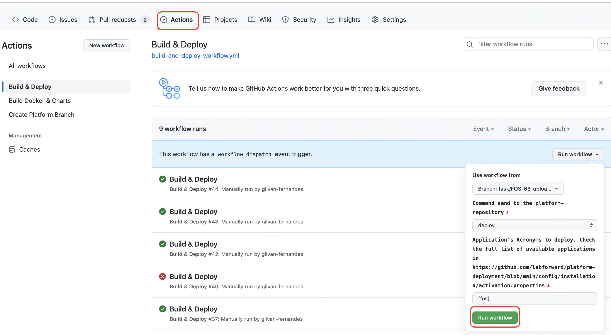

# What to Expect

One-click Build and Deploy in the Development environment:

# Workflows
All actions are triggering other GitHub or circleci processes.
You can still do everything without GHA. We are just making
it easier for you by centralizing everything in GH API!

# Releasing a New Version

To make a new GHA version available,
create a new GitHub release following the normal release process.
The new version will be available with the release-tag version.

# GHA Development Observation

- GHA will be available only when it reaches the main branch of the repository;
- Any changes in the triggers (on:) are applied only after merging with the main branch;
- Differently from the triggers, changes in the jobs are reflected in the target branch - it will run the code available in the specific branch instead of main.

# Actions

- [Create Platform Branch - deploy](platform/branch/create/README.md)
- [Trigger CircleCI - build](circleci/trigger/README.md)
- [Build & Deploy](platform/delivery/README.md)

# Usage Example

The workflows must be added in the *.github/workflows* directory, in the root of the application's repository.
You can copy our [example folder](example) directly into your application. Then:
- Add the *CCI_TOKEN* and *GH_PAT* secrets into your GitHub repository. These are the tokens to access CircleCI and other GH repositories;
- Look for the chart_name parameter and replace it with the manifest file name of your application in the platform-deployment repository.